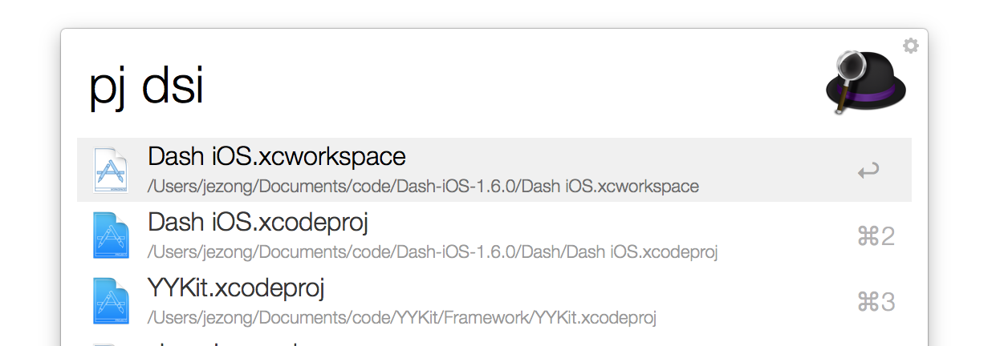
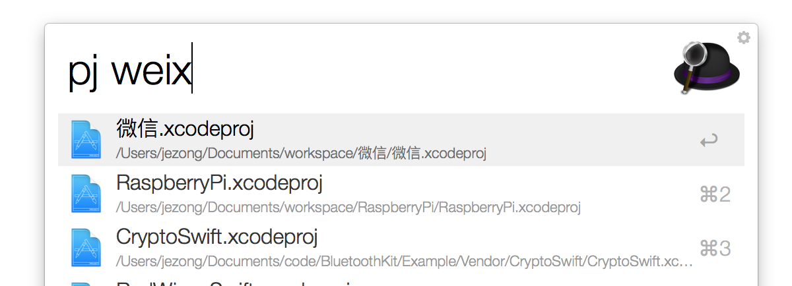

# SearchXcodeProjects
A Alfred workflow, which quick search and open your xcode projects in Mac

自己做的一个[Alfred](https://www.alfredapp.com/) Workflow，可以快速搜索硬盘中Xcode工程并打开

## 功能

1. 支持搜索`xcworkspace`、`xcproject`和`playground`工程
1. 模糊搜索
2. 拼音搜索
3. 按住`shift`键复制路径到剪切板
4. 按住`command`键在终端中打开

模糊搜索：

拼音搜索：

演示：

## 温馨提示
* 使用之前，必须先在`config.py`(workflow目录里)文件中配置`search_paths`，让脚本知道要在哪些路径去搜索你的Xcode工程。

* 暂时不支持中文字符，请用拼音代替

## License
适用于MIT协议